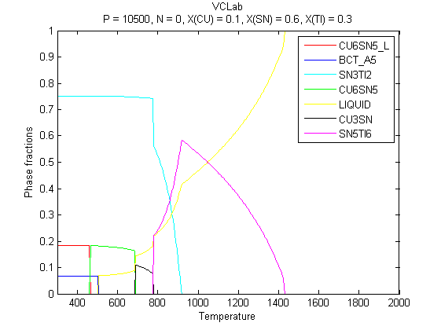
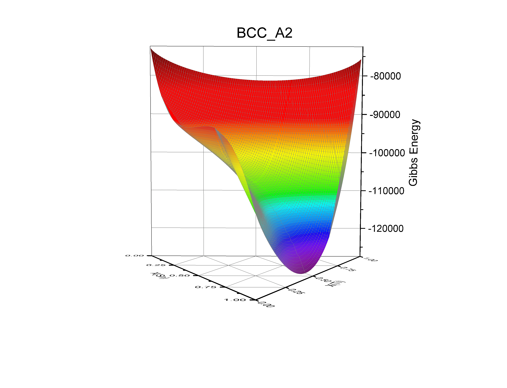

### VCLab
VCLab (Virtual CALPHAD Laboratory), an open-source software for CALPHAD Calculations written in C++.

### Author
* Xing Wang  <xingwang1991@gmail.com>

### Dependencies

* C++

### Model
What property can be calculated:
(1) Equilibrium
Calculate the thermodynamic equilibrium
(2) Gibbs energy surface
Calculate the Gibbs energy surface of specific phase.


### Database File
Database has the same format used in commercial software like Thermo-Calc and Pandat. One could put the Database file in the same folder with VCLab, or give the relative path of it, for instance '..\TDB\AlZn.TDB'.


#### Examples
##### Single point calculation
```python
Mode                       =    Equilibrium   !
Dimension                  =    0             !
Database_File              =    AlZn.TDB      ! 
Elements                   =    Al, Zn        !
Phases_Selected            =    all           ! 
Phases_Rejected            =    none          ! 
Pressure                   =    101325        !
Temperature                =    600           !
Compositions               =    0.6, 0.4      !
Global_Grid_Interval       =    0.02          !
```
Equilibrium can be found in the VCLOutput.txt file. A example is list below:
```python
===========================================
Conditions:   T = 600   P = 10500   N = 1
   X(AL) = 0.7
   X(ZN) = 0.3
===========================================
Equilibrium:

Chemical potential:
AL   580.969
ZN   495.04

Phase:
FCC_A1#2
Moles: 0.702168
X(AL) = 0.777535
X(ZN) = 0.222465

FCC_A1
Moles: 0.297832
X(AL) = 0.517203
X(ZN) = 0.482797
```

##### 1D calculation
One examples in Cu-Sn-Ti ternary system is:
```python
Mode                      =    Equilibrium   !
Dimension                 =    1             !
Database_File             =    cusnti.TDB    !
Elements                  =    cu, sn, ti    !
Compositions              =    0.1, 0.6, 0.3 !
Phases_Selected           =    all           !
Phases_Rejected           =    none          !
Pressure                  =    101325        !
Variables                 =    Temperature   !
V_start                   =    300           !
V_end                     =    2000          !
V_Interval                =    5             !
Global_Grid_Interval      =    0.02          !
```



##### 2D calculation
Calculate the Gibbs energy surface of BCC_A2 Phases in Cu-Sn-Ti ternary system.

```python
Mode                      =    Energy Surface !
Database_File             =    cusnti.TDB     ! 
Elements                  =    cu, sn, ti     !
Phases_Selected           =    BCC_A2         ! 
Phases_Rejected           =    none           ! 
Pressure                  =    101325         !
Temperature               =    800            !
Global_Grid_Interval      =    0.02           !
```


